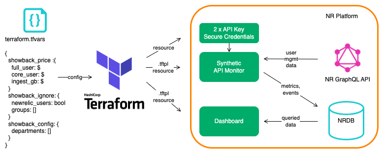
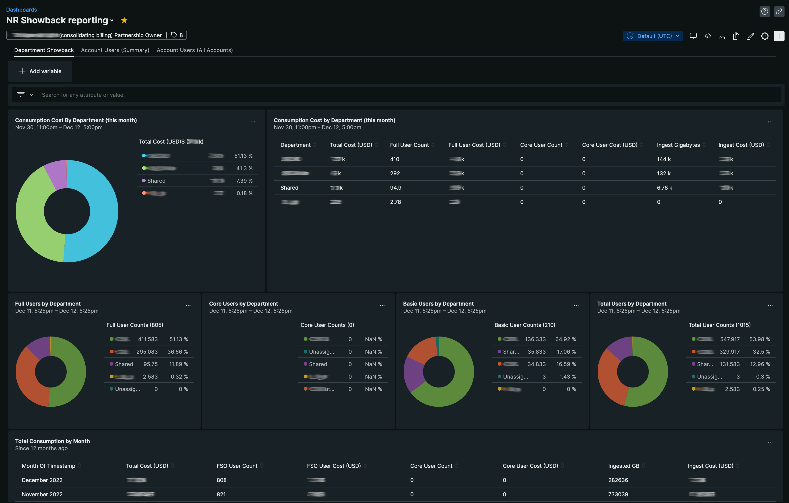
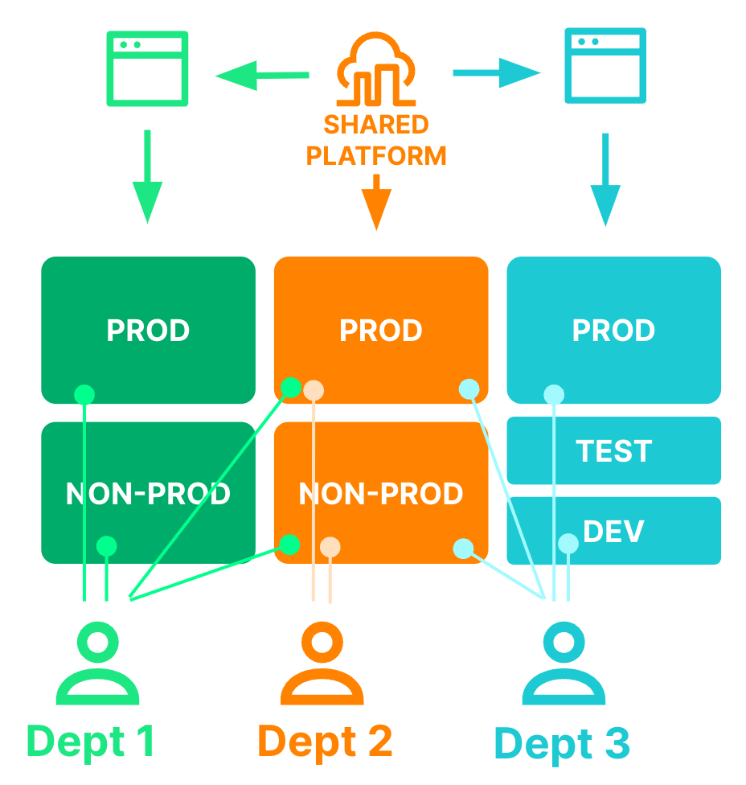
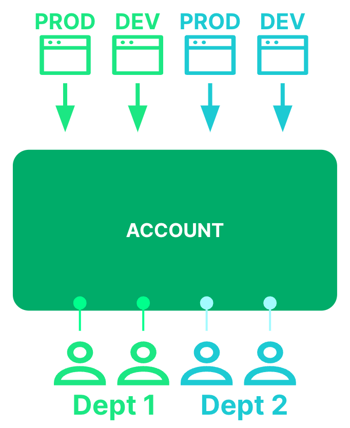

[](https://opensource.newrelic.com/oss-category/#new-relic-experimental)
# nr-showback

This repository provides an automated way to report New Relic ingest consumption and user costs, by business department, using aggregated account-based cost allocation.



A single [terraform.tfvars](terraform.tfvars) file contains the definition of departments within a business, a customer’s prices for ingest and user consumption, and the ability to ignore certain groups. Applying the terraform via a wrapper script creates a synthetics script, secure credentials containing API keys, and an associated dashboard. Once every 24 hours, the synthetics script queries the New Relic GraphQL API for a customer’s organization and user management data structures. Based upon a model of hierarchical account-based cost allocation, showback data is posted into NRDB as metrics, and user data as custom events. To view the showback data, customers access a dashboard that is built, and kept in sync with the departmental definitions, by terraform configuration.



## Will it work for *us*?
### Good fit
Assuming that a customer has created a hierarchical account structure, where each department has one or more accounts, it is possible to aggregate costs associated with each account at a departmental level. Let’s call these hierarchical account structures. Customers with hierarchical account structures are a good fit for the automation provided in this repo.



### Poor fit
Alternatively, a customer might have a simple account structure, where all departments share a single account, or common Prod/QA/Dev accounts for example. Let’s call these non-hierarchical account structures. These are a poor fit for the approach described here. 



## User apportioning method
This showback solution uses a user apportioning method. It works as follows:
- If a user is in a single account, their user is allocated to that account
- If a user is in more than one account, their user is apportioned to each account equally. For example, a user in two accounts will have ½ a user allocated to each account; and a user in three accounts will have ⅓ of a user apportioned to each account.

Specific groups can be ignored if, say, all users are members of a group with read-access to all accounts.

## Installation
Make sure terraform is installed. We recommend [tfenv](https://github.com/tfutils/tfenv) for managing your terraform binaries.

Update the [runtf.sh.sample](runtf.sh.sample) wrapper file with your credentials and account details and rename it `runtf.sh`.Alternatively, if you are running from Windows: update the [runtf.bat.sample](runtf.bat.sample) wrapper file with your credentials and account details and rename it `runtf.bat`.  **Important do not commit this new file to git!** (It should be ignored in `.gitignore` already.) 

The wrapper file contains configuration of three API keys:
1.  `NEW_RELIC_API_KEY`: a User API key to create terraform resources
2.  `TF_VAR_showback_query_user_api_key`: a User API key to query user management configuration in GraphQL - stored as a secure credential in Synthetics under the name `SHOWBACK_QUERY_USER_API_KEY`
3.  `TF_VAR_showback_insert_license_api_key`: an Ingest API key for posting showback and user data in NRDB - stored as a secure credential in Synthetics under the name `SHOWBACK_INSERT_LICENSE_API_KEY`

The user associated with the `TF_VAR_showback_query_user_api_key` variable must have a user type of Full or Core, and be a member of a group with Organization and Authentication Domain [Administration settings](https://docs.newrelic.com/docs/accounts/accounts-billing/new-relic-one-user-management/user-management-concepts#admin-settings) enabled.

The account IDs used for the terraform resources, billing account, and reporting account may be different, but are all likely to be the billing account.

The wrapper file also allows the configuration of the following:
1.  `TF_VAR_monitor_name`: the name of the showback reporting script on the reporting account
2.  `TF_VAR_dashboard_name`: the name of the showback dashboard on the reporting account
3.  `TF_VAR_event_name_prefix`: the prefix used in nr-showback metric names, defaults to "Showback", resulting in events of the form "Showback_UniqueUsers" for example. It is recommended that this value is modified during testing, e.g. to TestShowback, and reverted for production use
4.  `TF_VAR_metric_name_prefix`: the prefix used in nr-showback metric names, defaults to "showback", resulting in metrics of the form "showback.department.fulluser.count" for example. It is recommended that this value is modified during testing, e.g. to test.showback, and reverted for production use

Note: You may want to update the version numbers in [provider.tf](provider.tf) and [modules/monitor/provider.tf](modules/monitor/provider.tf) to the latest versions of Terraform and the New Relic provider. You will need to update both provider.tf files if you are using the EU region.

## Showback configuration
The showback configuration is entirely within the terraform.tfvars file. Copy [terraform.tfvars.sample](terraform.tfvars.sample), which is populated with an example config to a file named `terraform.tfvars`. Modify the configuration for your account. The configuration contains:
- `showback_price`: the costs for:
  - full users (`full_user_usd`)
  - core users (`core_user_usd`)
  - billable ingest per GB (`gb_ingest_usd`)
- `showback_ignore.groups`: whether specific user group membership should be ignored. Some customers grant read-only access to all accounts, which breaks the script’s showback user apportioning
- `showback_ignore.newrelic`: whether New Relic employees should be ignored in the showback charge, set to `true`, but can be changed
- `showback_config`: for each department, the `department_name`, an optional `tier` value (for grouping departments into higher level reporting units), and accounts either as a list (`accounts_in`) or as a list of one or more regular expressions (`accounts_regex`)

The expectation with the tier value is that all accounts are separately mapped to one or more reporting units. Any additional tiers will be displayed on a separate page on the dashboard with the page title set to the tier name, e.g. 'Reporting Unit'.

## Initialization
Use the `runtf.sh` helper script wherever you would normally run `terraform`. It simply wraps the terraform with some environment variables that make it easier to switch between projects. (You don't have to do it this way, you could just set the env vars and run terraform normally.)

First initialise terraform:
```
./runtf.sh init
```

Now apply the changes:
```
./runtf.sh apply
```

## State storage
This example does not include remote state storage. State will be stored locally in `terraform.tfstate`.

## Showback NRDB data types
The synthetics script, default name NR Showback reporting script, posts four types of data back to NRDB, they are:
1. `showback.department.*` and aggregated `showback.organization.*` metrics, containing breakdowns of the number of users by type at the department and organization levels.
2. `showback.account.*` metrics, containing breakdowns of the number of users by type at an account level.
3. `Showback_UniqueUsers` custom events, containing an event per unique user with their last access time, user type and a set of the departments to which they have been allocated.
4. `Showback_AccountUsers` custom events, containing an event per user, per role, per account.

## Dashboard reporting
The dashboard, default name `NR Showback reporting`, contains three pages:
1. `Department Showback` (shown above)
- A breakdown of costs, both ingest and user per department
- Widgets showing the breakdown of users by type per department
- A table showing the monthly ingest and user consumption at the billing account level
2. `Account Users (Summary)`
- A tabular breakdown of users per account
- User type counts over time
- A table listing each unique user in the organization (all authentication domains) by email address, along with each department they are allocated against
3. `Account Users (All Accounts)`
- A repeat of the tabular breakdown of users per account
- A full list of each user and every role, for every account they have access to

# Support

New Relic has open-sourced this project. This project is provided AS-IS WITHOUT WARRANTY OR DEDICATED SUPPORT. Issues and contributions should be reported to the project here on GitHub.

We encourage you to bring your experiences and questions to the [Explorers Hub](https://discuss.newrelic.com) where our community members collaborate on solutions and new ideas.

## Issues / enhancement requests

Issues and enhancement requests can be submitted in the [Issues tab of this repository](../../issues). Please search for and review the existing open issues before submitting a new issue.

# Contributing

Contributions are encouraged! If you submit an enhancement request, we'll invite you to contribute the change yourself. Please review our [Contributors Guide](CONTRIBUTING.md).

Keep in mind that when you submit your pull request, you'll need to sign the CLA via the click-through using CLA-Assistant.

# Open source license
This project is distributed under the [Apache 2 license](LICENSE).
